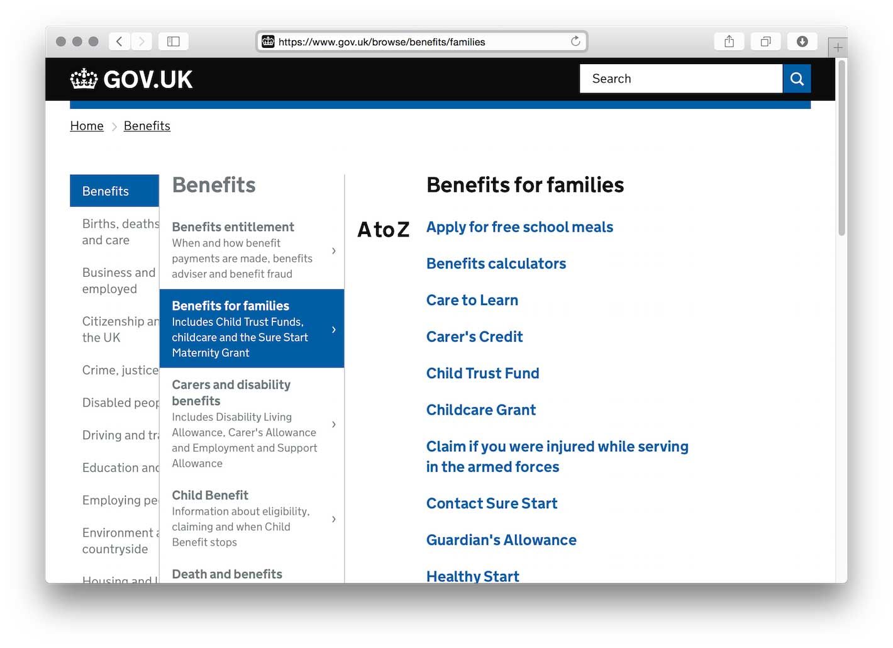
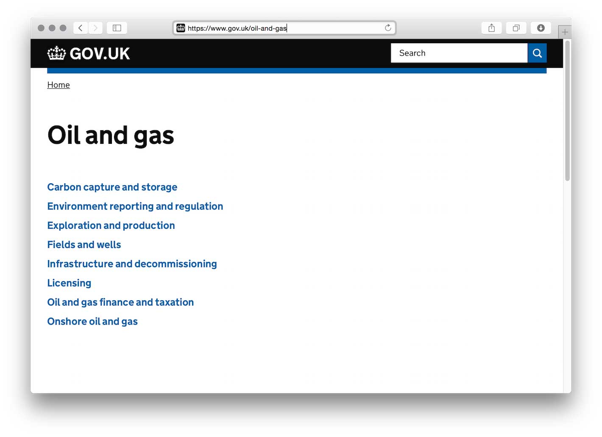
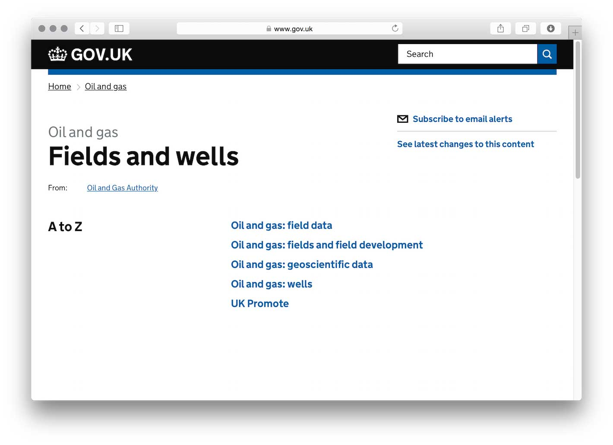
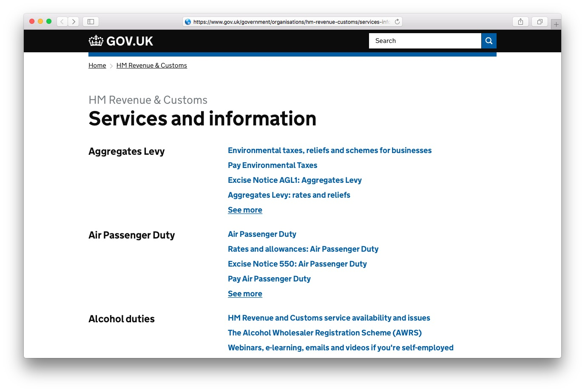
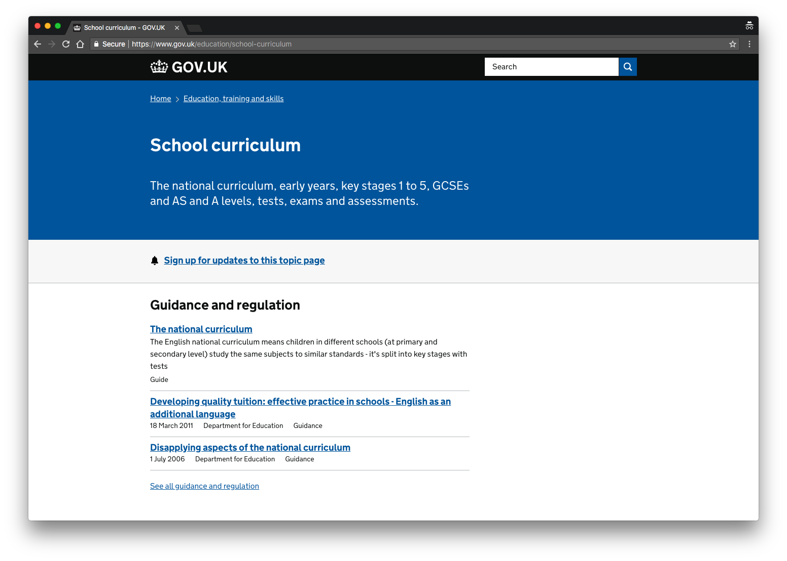
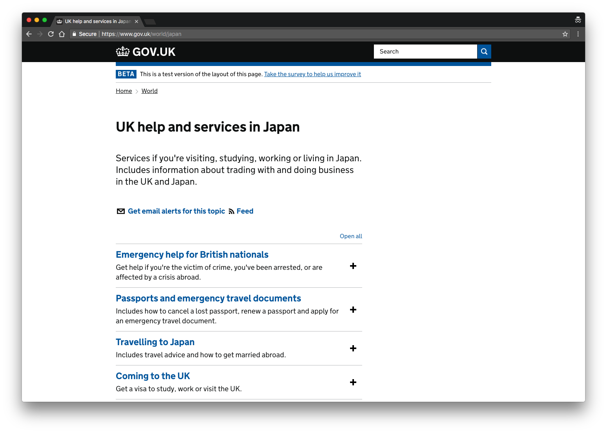
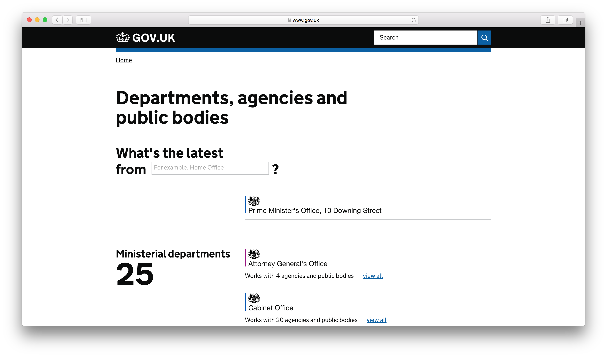
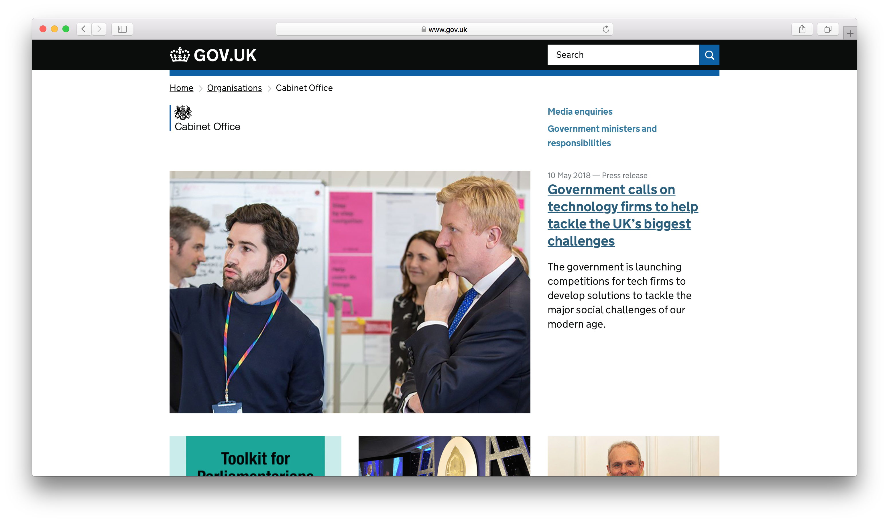
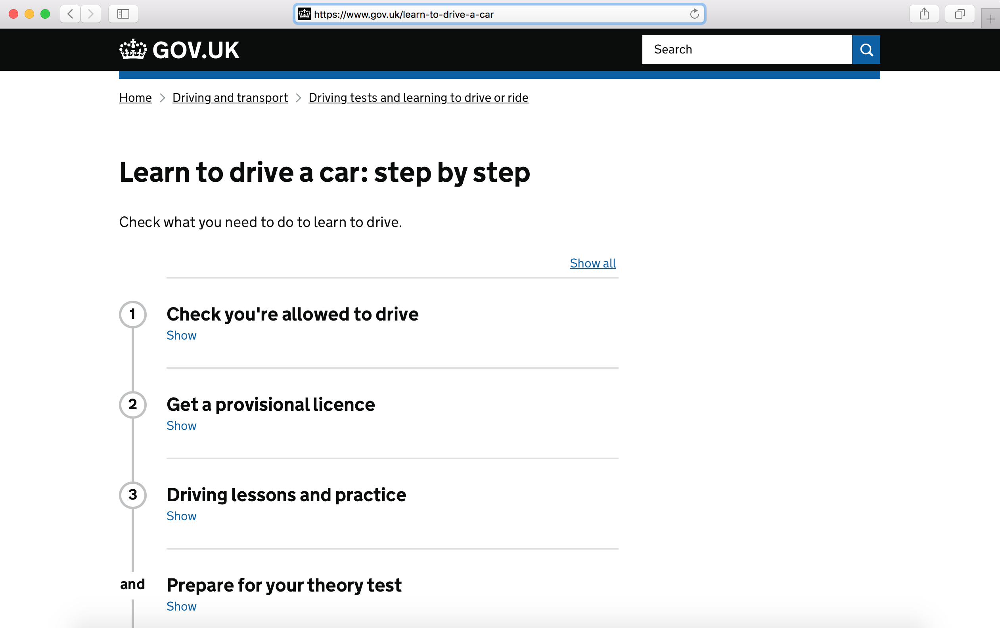

# Collections Frontend

Collections serves the GOV.UK navigation pages and organisation pages.

## Screenshots

### Browse page



### Topic page



### Subtopic page



### Services and information page



### Taxonomy page



### Worldwide taxonomy page



### Organisation index page



### Organisation page



### Step by step page



## Live examples

- Browse page: [gov.uk/browse](https://www.gov.uk/browse)
- Topic page: [gov.uk/oil-and-gas](https://www.gov.uk/oil-and-gas)
- Subtopic page: [gov.uk/oil-and-gas/fields-and-wells](https://www.gov.uk/oil-and-gas/fields-and-wells)
- Services and information page: [gov.uk/government/organisations/hm-revenue-customs/services-information](https://www.gov.uk/government/organisations/hm-revenue-customs/services-information)
- Taxonomy page: [gov.uk/education](https://www.gov.uk/education)
- Worldwide taxonomy page: [gov.uk/world/japan](https://www.gov.uk/world/japan)
- Organisation index page: [gov.uk/government/organisations](https://www.gov.uk/government/organisations)
- Organisation page: [gov.uk/government/organisations/cabinet-office](https://www.gov.uk/government/organisations/cabinet-office)
- Step by step page: [gov.uk/learn-to-drive-a-car](https://www.gov.uk/learn-to-drive-a-car)

## APIs

The endpoints and known consumers of this application's APIs are documented in [docs/api](docs/api.md)

## Nomenclature

### Topics

- **Curated list**: a group of content tagged to a subtopic that has been
  curated into a named list.
- **Topic**: a named group of sub-topics. (A deprecated name for this is "specialist sector".)
- **Sub-topic**: a group of content within a topic. (A deprecated name for this is
"specialist sub-sector".)

### Browse pages

- **Root browse page**: [gov.uk/browse](https://www.gov.uk/browse)
- **Top level browse page**: [gov.uk/browse/benefits](https://www.gov.uk/browse/benefits)
- **Second level browse page**: [gov.uk/browse/benefits/entitlement](https://www.gov.uk/browse/benefits/entitlement)

### Taxonomy
The taxonomy is surfaced on taxon pages, which group together tagged content for that level of the taxonomy into [supergroups](https://docs.publishing.service.gov.uk/document-types/content_purpose_supergroup.html) on the page, e.g: Guidance and Regulation for Funding and finance for students [gov.uk/education/funding-and-finance-for-students](https://www.gov.uk/education/funding-and-finance-for-students). Each taxon page also shows a grid of sub-topics at the next level of the taxonomy.

### Worldwide taxonomy
The worldwide taxonomy is rendered on different types of pages depending on whether the taxon has any children.

For example:
- **Taxon with children**: a content item of type taxon that has
  `child_taxons` links. None of those child taxons' links have `child_taxons`,
  in which case we display an accordion view:
  [gov.uk/world/afghanistan](https://www.gov.uk/world/afghanistan)
- **Taxon without children**: a content item of type taxon that doesn't have
  `child_taxons` links. In this case we display an leaf view:
  [gov.uk/world/living-in-afghanistan](https://www.gov.uk/world/living-in-afghanistan)
- **Taxon with associated taxons**: a content item of type taxon that has
  `associated_taxons` links. In this case the tagged content of the taxon will
  include content that is directly tagged to it and also content that has been
  tagged to any of the associated taxons.


## Technical documentation

This is a public facing Ruby on Rails application that retrieves browse content from APIs and presents it.
There is no underlying persistence layer and all content is retrieved from external sources.

### Content for taxon pages

Content for taxon pages is returned by a search in Rummager based on content_ids for world taxonomy pages and content_ids and [supergroups](https://docs.publishing.service.gov.uk/document-types/content_purpose_supergroup.html) for all other taxonomy pages.

### Dependencies

- [content-store](https://github.com/alphagov/content-store), provides:
    - Mainstream browse pages (Root, Top and Second level browse pages)
    - Topics
    - Subtopics and their curated lists
- [rummager](https://github.com/alphagov/rummager), provides:
    - latest changes for Topics
    - content tagged to a particular Topic, Mainstream browse page or Organisation
- [email-alert-api](https://github.com/alphagov/email-alert-api), provides:
    - support for subscribing to notifications from a topic

### Running the application

```
./startup.sh
```

The app should start on http://localhost:3070 or
http://collections.dev.gov.uk on GOV.UK development machines.

```
./startup.sh --live
```

This will run the app and point it at the production GOV.UK `content-store` and `static` instances.

```
./startup.sh --dummy
```

This will run the app and point it at the [dummy content store](https://govuk-content-store-examples.herokuapp.com/), which serves the content schema examples and random content.


### Running the test suite

Use `bundle exec rake` to run the test suite, excluding JavaScript

#### Javascript tests

Use `bundle exec rake jasmine:ci` to run Jasmine tests

## License

[MIT License](LICENCE.txt)
