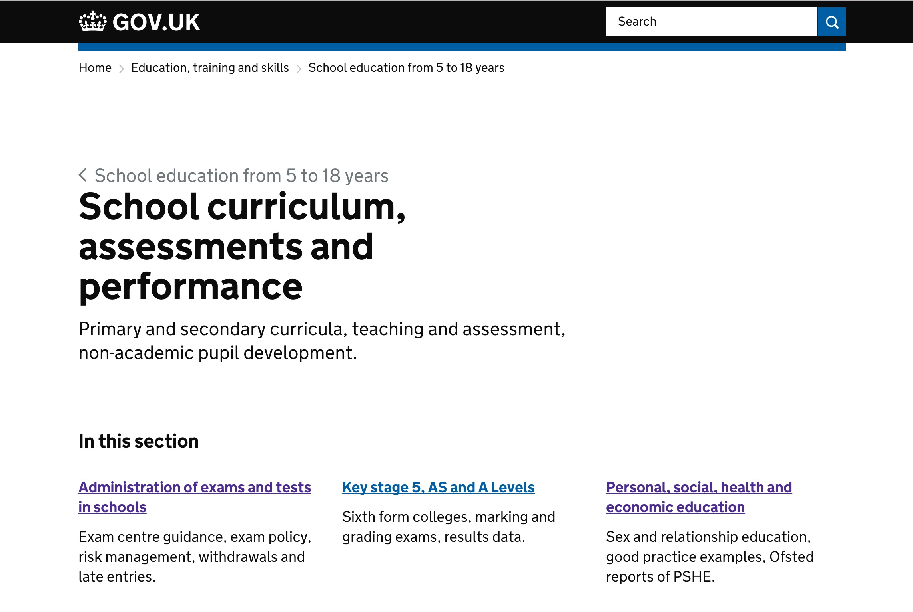

# Collections Frontend

Collections serves the GOV.UK browse and topic pages.

(As of June 2015)

## Live examples

- Browse page: [gov.uk/browse](https://www.gov.uk/browse)
- Topic page: [gov.uk/oil-and-gas](https://www.gov.uk/oil-and-gas)
- Subtopic page: [gov.uk/oil-and-gas/fields-and-wells](https://www.gov.uk/oil-and-gas/fields-and-wells)
- Services and information page: [gov.uk/government/organisations/hm-revenue-customs/services-information](https://www.gov.uk/government/organisations/hm-revenue-customs/services-information)
- Taxonomy page (currently only on integration):
  [gov.uk/education](https://www-origin.integration.publishing.service.gov.uk/education)

## Nomenclature

### Topics

- **Curated list**: a group of content tagged to a subtopic that has been
  curated into a named list.
- **Topic**: a named group of sub-topics. (A deprecated name for this is "specialist sector".)
- **Sub-topic**: a group of content within a topic. (A deprecated name for this is
"specialist sub-sector".)

### Browse pages

- **Root browse page**: [gov.uk/browse](https://www.gov.uk/browse)
- **Top level browse page**: [gov.uk/browse/benefits](https://www.gov.uk/browse/benefits)
- **Second level browse page**: [gov.uk/browse/benefits/entitlement](https://www.gov.uk/browse/benefits/entitlement)

### Taxonomy

- **Taxon with grandchildren**: a content item of type taxon that has
  `child_taxons` links. Some or all of those child taxons also have
  `child_taxons` links, which means we display a grid of child taxons -
  [gov.uk/education](https://www-origin.integration.publishing.service.gov.uk/education)
- **Taxon without grandchildren**: a content item of type taxon that has
  `child_taxons` links. None of those child taxons' links have `child_taxons`,
  in which case we display an accordion view:
  [gov.uk/education/school-governance](https://www-origin.integration.publishing.service.gov.uk/education/school-governance)

## Technical documentation

This is a public facing Ruby on Rails application that retrieves browse content from APIs and presents it.
There is no underlying persistence layer and all content is retrieved from external sources.

### Whitehall email and feed links for World Locations

A special case exists within Collections to allow email links on Taxon pages to be generated
such that they point to the email subscription logic in Whitehall. This is
currently implemented in `app/helpers/email_helper.rb` with the branching logic
sitting in `app/views/taxons/_email_alerts.html`.

The intention is to migrate rendering of World Location pages from Whitehall to
Collections. Whitehall serves these from `/government/world/{world_location}`.
Collections will serve these from `/world/{world_location}`.

The helper currently tests for `base_path` starting with `/world` and provides two methods;
one to create an atom link and one to create an email link.

Once email subscriptions for World Locations have been completely ported to use
Email Alert Api, this functionality can be removed.

### Dependencies

- [content-store](https://github.com/alphagov/content-store), provides:
    - Mainstream browse pages (Root, Top and Second level browse pages)
    - Topics
    - Subtopics and their curated lists
- [rummager](https://github.com/alphagov/rummager), provides:
    - latest changes for Topics
    - content tagged to a particular Topic, Mainstream browse page or Organisation
- [email-alert-api](https://github.com/alphagov/email-alert-api), provides:
    - support for subscribing to notifications from a topic

### Running the application

`bundle exec rails server`

### Running the test suite

Use `bundle exec rake` to run the test suite, excluding JavaScript

#### Javascript tests

Use `bundle exec rake spec:javascript` to run Jasmine tests  
Alternatively, visit [`collections.dev.gov.uk/specs`](http://collections.dev.gov.uk/specs)
for a live debugger in your browser

## License

[MIT License](LICENCE.txt)
